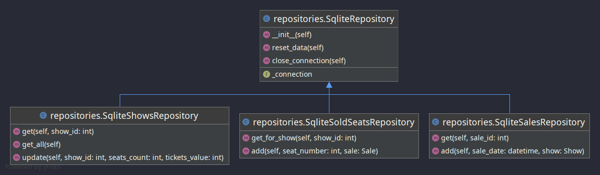

# Homework 4

## Syncronization

### Weak points

- when adding a new sale to the repo
- when adding a new sold seat to the repo

### Solutions

- using `threading.Lock` in the `sell_seats` service when adding new sales and sold seats to the database
- using `transactions` by default on sqlite database operations
- implementing `future/promises` by using `execute` from `ThreadPoolExecutor`  

## Diagrams & docs

Services:

- sell\_seats: does validation operations and adds a new sale object to the repo and the corresponding sold seats
- verify\_sells: verifies data coherence between the shows and sold tickets and writes virification data to a file

